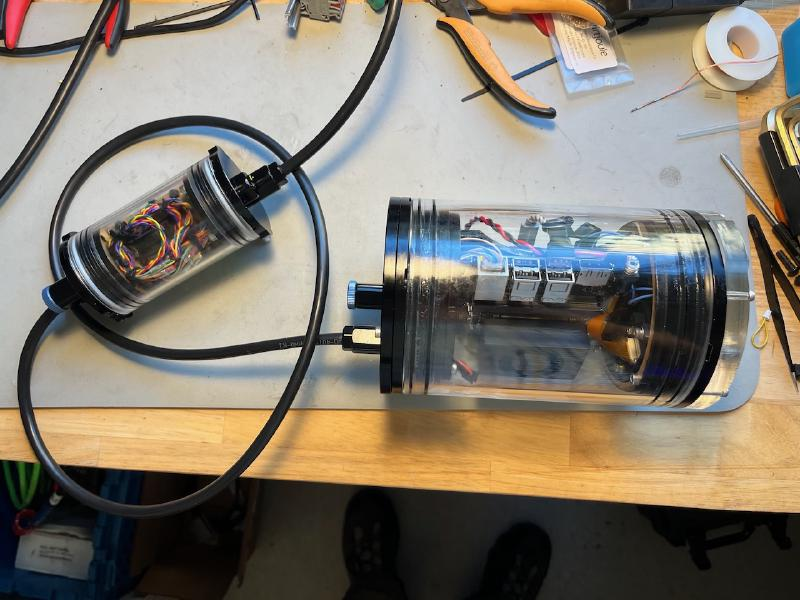

 * [Bill of materials](bill_of_materials.md)
 * [Sensor board](sensor_board_md)
 * [IMU](imu.md)

## Documentation:

* [Jetson Orin Nano DevKit Carrier Board Specification](resources/Jetson-Orin-Nano-DevKit-Carrier-Board-Specification_SP-11324-001_v1.2.pdf)
* [P3768_A04_Concept_schematics.pdf](resources/P3768_A04_Concept_schematics.pdf)

## Aaron's journal:

* [2024‐10‐14 First contact with Nano](journal/2024‐10‐14-Jetson-Bringup.md)
* [2024‐10‐21 Adapting AlliedVision buildscripts](journal/2024‐10‐21-Adapting-AlliedVision-buildscripts.md)
* [2024-10-23 Cataloging the VC modules on Mouser](journal/2024‐04‐23-Considering-Vision-Components-camera-options.md)
* [2024-10-31 First light with VC MIPI Module](journal/2024‐10‐31-First-test-with-Vision-Component-MIPI-module.md)

## Useful links:

* Promising result with Arducam driver: 
    * https://forums.developer.nvidia.com/t/picamera3-imx708-and-j40header-config-for-pwm-servo-on-jetpack6-solution/295489
    * https://docs.arducam.com/Nvidia-Jetson-Camera/Native-Camera/Quick-Start-Guide/#12mp-imx708-camera   