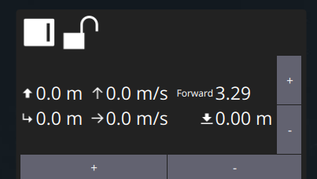
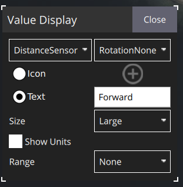

A down-facing sensor connected via MAVLink should send [DISTANCE_SENSOR](https://mavlink.io/en/messages/common.html#DISTANCE_SENSOR) messages
with orientation set to `MAV_SENSOR_ROTATION_PITCH_270`.

However, if the ROV already has a down-facing rangefinder (or DVL) then the messages from the 2 different sensors may
collide. (Both ArduSub and QGC assume that there is only 1 rangefinder sensor pointing in a particular direction,
and they both ignore the id field.) The workaround is to set up a new sensor with a different orientation, such as
`MAV_SENSOR_ROTATION_NONE`.

You can use BlueOS or QGC to set up a rangefinder sensor in ArduSub: 
* In BlueOS go to ArduPilot Parameters
* In QGC go to Vehicle Setup > Parameters
* Set RNGFND2_TYPE to 10 (MAVLink)
* Reboot the autopilot so the rest of the RNGFND2_* parameters appear
* Set RNGFND2_MIN and RNGFND2_MAX to something like [0.2, 50]
* Set RNGFND2_ORIENT to 0 (MAV_SENSOR_ROTATION_NONE, or Forward)
* Reboot again

You should now have DISTANCE_SENSOR messages forwarded to QGC. You can see them appearing
in both BlueOS and and QGC by using the MAVLink Inspector.

In QGC you can now display the distance in the widget at the bottom of the screen:

Click on the lock to unlock the widget, then click on a field to edit it:

