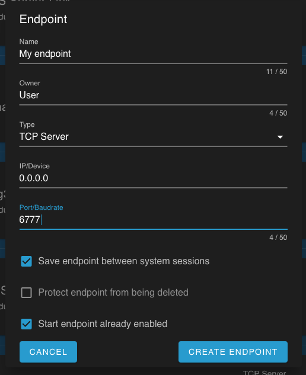

Minimum examples for connecting to a BlueROV using [pymavlink]()

The default connection used in these scripts is `tcpin:192.168.2.2:6777`.  This is a **non-standard** configuration and must be manually enabled on the BlueROV.

To do so, log into the ROV's website, enable "Pirate Mode" and go to "Mavlink Endpoints."   Select "+" to to create a new endpoint as shown:



I also strongly recommend switchin the "MAVP2P" at the top of the page, although it should work with both options.

To install:

```shell
pip install .
```

This package contains two sample scripts:

* `query_mavlink` will connect to the endpoint and display every `HEARTBEAT` message sent by any component on the system
* `send_mavlink` will send a single heartbeat message with "mavlink_version" of 99

To test, run `query_mavlink` in one window.  The system will display mavlink messages.

Then run `send_mavlink` in separate window, one instance of a heatbeat message with a version of 99 will appear in the `query_mavlink_ windows.
